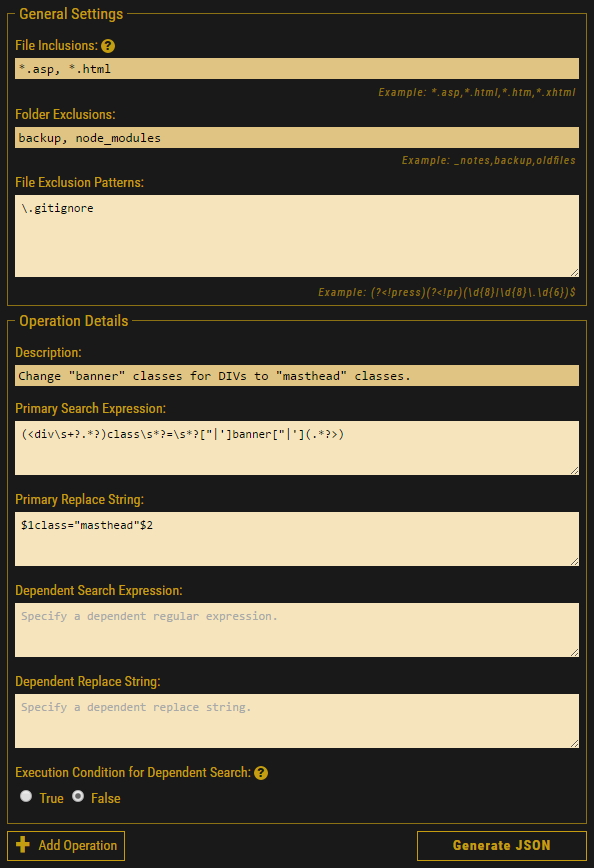
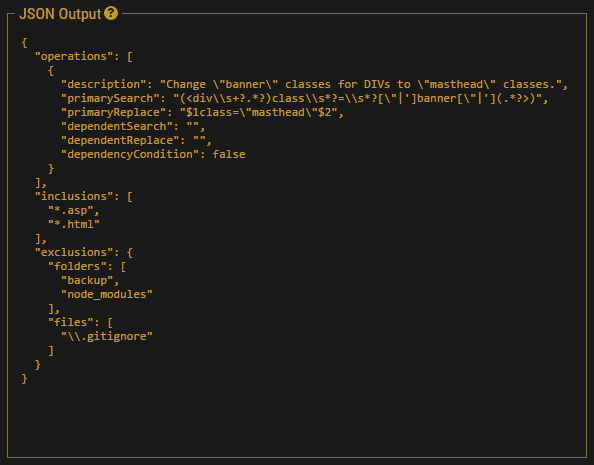
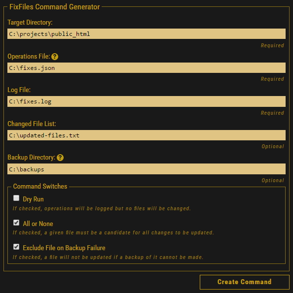

# FixFiles
The FixFiles system is a PowerShell-based system for running any number of search-and-replace operations (defined in an external JSON file) against any number of text-based files and logging the results. When a target file matches a search pattern and is therefore a candidate for the associated replace operation, the existing file is backed up (if a backup folder has been specified by the user) before being modified or the existing file is renamed (using a simple datetime suffix, e.g., "default.20161225.asp") as a kind of in-place backup mechanism and a new file with the current name (e.g., "default.asp") is then written to disk.

## Files
* fixfiles.ps1 - The core of the FixFiles system. A PowerShell script that can be executed to run user-defined search-and-replace operations. Accepts a JSON file as input.
* fixfiles.html - The **FixFiles Configuration Generator** for creating JSON input files for the PowerShell script and for creating a valid PowerShell command to execute the fixfiles.ps1 Powershell script.
* operations-template.json - A JSON template showing the format for search-and-replace definitions.
* README.md - This readme file.
* LICENSE - The license file.

## Basic Usage
The search and replace operations defined for processing by the FixFiles system rely on regular expressions, and that can be scary:

  > Some people, when confronted with a problem, think "I know, I'll use regular expressions." Now they have two problems. --- Jamie Zawinksi

Regular expressions are not especially easy to debug, but you can work on them in various text editors (like Sublime Text) and you can see them represented visually (which can help you in building them) in such online tools as http://www.debuggex.com and you can also work on them at http://www.regexr.com/.

You can execute the FixFiles script (fixfiles.ps1) from a PowerShell prompt or from the PowerShell IDE. You may have to configure your script execution privileges in order to run PowerShell scripts. (See http://go.microsoft.com/fwlink/?LinkID=135170 for more information).

This script will probably not be included in your PATH environment variable, so to execute the script, change into the directory containing the script from the prompt and type a dot (.) followed by a backslash (\\) followed by the name of the script. The "targetDirectory", "operationsFile", and "logFile" parameters are mandatory. The "fileList" specification and the switches ("-dryrun", "-allornone", and "-excludeOnBackupFailure") are optional.

The format of the JSON operation-definition file (specified by the "operationsFile" parameter) must be in accordance with the following pattern:

```json
{
  "operations": [
    {
      "description": "A description of the operation",
      "primarySearch": "A regular-expression-based search pattern",
      "primaryReplace": "A regular-expression-based replace pattern",
      "dependentSearch": "A secondary search pattern or an empty string",
      "dependentReplace": "A secondary replace pattern or an empty string",
      "dependencyCondition": "The condition under which the dependent operation executes. If 'false', then the secondary operation runs only if the primary search operation fails to find anything. If 'true', then the secondary operation runs only if the primary search is successful. The only permitted values are 'true' or 'false'."
    },
    {
      "description": "A description of another operation",
      "primarySearch": "Another regular-expression-based search pattern",
      "primaryReplace": "Another regular-expression-based replace pattern",
      "dependentSearch": "",
      "dependentReplace": "",
      "dependencyCondition": false
    }
    {
      "description": "A description of yet another operation. (You can add any number of additional operations.)",
      "primarySearch": "Another regular-expression-based search pattern",
      "primaryReplace": "Another regular-expression-based replace pattern",
      "dependentSearch": "",
      "dependentReplace": "",
      "dependencyCondition": false
    }
  ],
  "inclusions": [
    "myonefile.txt",
    "*.asp",
    "*.html",
    "*.htm",
    "*.xhtml",
    "etc.",
    "etc."
  ],
  "exclusions": {
    "folders": [
        "foldername1",
        "foldername2",
        "parentfolder\\subfolder"
    ],
    "files": [
        "A regular-expression-based search pattern",
        "Another regular-expression-based search pattern",
        "etc.",
        "etc."
    ]
  }
}
```

For a given operation definition (object), the "description", "primarySearch", and "primaryReplace" values are required. The "description" and "primaryReplace" values can be empty strings. The "primarySearch" value can consist entirely of spaces or any valid regular expression, but it can't be an empty string. The "dependentSearch" member doesn't have to be included at all. But if it is included and intended to be executed, then a "dependentReplace" value must be specified as well. The "dependencyCondition" member/value doesn't need to be specified. If it's not specified, it is assumed to be "false".

The "inclusions" and "exclusions" sections of the JSON definition file are optional. If you don't specify any inclusions, then the process will be executed against every file found in the specified target directory. The exclusions section allows for a given file type (e.g., "*.txt") to be included (using the inclusions section) but excluded based on a given file name pattern (e.g., "backup.txt"). You can specify folder names in the "folders" array (either as literal strings or regular expressions) and you can specify regular expression patterns for files to exclude.

This is minimal default template for an operation definition file:

```json
{
  "operations": [
    {
      "description": "Description",
      "primarySearch": "",
      "primaryReplace": "",
      "dependentSearch": "",
      "dependentReplace": "",
      "dependencyCondition": false
    }
  ],
  "inclusions": [
    "*.asp",
    "*.html",
    "*.htm",
    "*.xhtml"
  ],
  "exclusions": [
    {
      "folders": [
        ""
      ],
      "files": [
        ""
      ]
    }
  ]
}
```

Keep in mind that in order for the strings in this JSON file to be valid, certain characters must be "escaped". For regular expressions, the main characters you will have to escape are double quotes (") and backslashes (\\). That is, if your search regular expression were something like the following:

`<p>"We\swere\ssoldiers\sonce,\sand\syoung,"\she\ssaid\.<p>`

To include that in your JSON file as a value in a key/value pair, you'd have to escape the backslashes and quotes and then put the whole string in quotes
(because string values in JSON files MUST be double-quoted per the JSON spec):

`"primarySearch": "<p>\"We\\swere\\ssoldiers\\sonce,\\sand\\syoung,\"\\she\\ssaid\.</p>"`

## The FixFiles Configuration Generator
The proper format for operation definition files is simply something to be aware of. You will probably not be creating these JSON operation definition files manually. The easiest way to create a valid JSON operations file is to use the **FixFiles Configuration Generator** (fixfiles.html). The FixFiles Configuration Generator can build a valid operation definition file and you can also use it to create a valid PowerShell command-line command expression to execute the FixFiles script.

In other words, the FixFiles Configuration Generator (fixfiles.html) is a kind of GUI for the FixFiles PowerShell script (fixfiles.ps1). Open fixfiles.html in any modern browser and specify general settings, such as files to include or exclude and folders to exclude, and define each operation:



You can add additional operations by clicking the "Add Operation" button. Then, click the "Generate JSON" button to generate the appropriate output:



Copy that JSON output into a text file to use as input to the FixFiles PowerShell script (fixfiles.ps1). You don't have to give the file a ".json" extension, but it might be easier to work with in a text editor if you do so. The file might be named, for example, fixes.json.

Then specify the parameters and settings for executing the FixFiles PowerShell script in the FixFiles Command Generator section:



Then click the "Create Command" button and a PowerShell command-line statement will be generated, which you can then copy to a PowerShell console to execute. An example generated command:

`.\fixfiles 'C:\projects\public_html' 'C:\fixes.json' 'C:\fixes.log' -fileList 'C:\updated-files.txt' -backupDirectory 'C:\backups' -allornone -excludeOnBackupFailure`

Happy Searching & Replacing!

## Contributions
- If you **find a bug** or **have a feature request**, please open an issue.
- If you'd **like to contribute**, please submit a pull request.

## License
The FixFiles system is open-sourced software licensed under the [MIT license](http://opensource.org/licenses/MIT). See LICENSE for details.